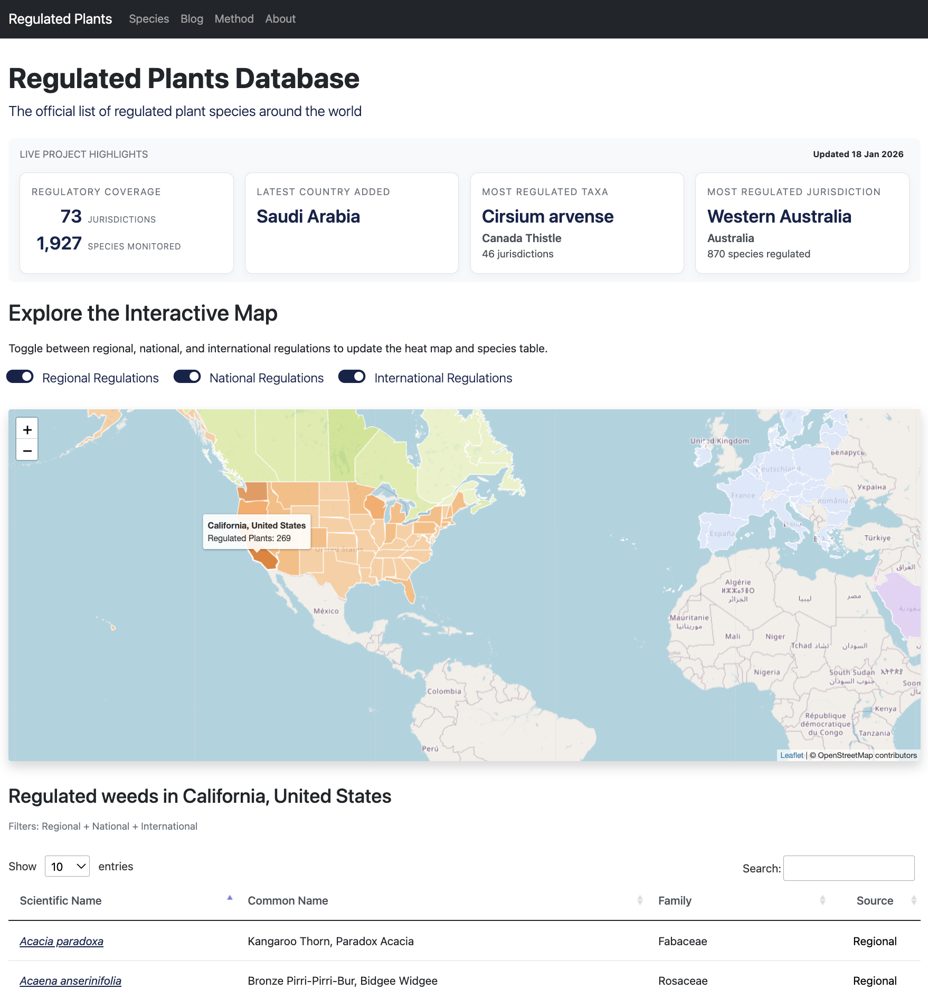

# Regulated Plants Database (Web App)

> Public web app for exploring regulated invasive plant species. Data is fetched from a private data service and cached locally; a small sample dataset is included for local development.



---

## Table of Contents
1. [Features](#features)
2. [Tech Stack](#tech-stack)
3. [Getting Started](#getting-started)
4. [Environment Configuration](#environment-configuration)
5. [Local Sample Data](#local-sample-data)
6. [Remote Data Service](#remote-data-service)
7. [Deployment](#deployment)
8. [Project Structure](#project-structure)
9. [Contributing](#contributing)

---

## Features
- **Interactive Leaflet map** with dynamic colour ramps, tooltips, and toggleable regulation layers.
- **Search + tables** for regulated species, including export and summary views.
- **REST endpoints** for map data, counts, blog posts, and contact form submission.
- **Blog + methodology pages** with sources and project background.

## Tech Stack
- **Backend:** Flask, SQLite (via custom utility classes in `app/utils`)
- **Frontend:** Bootstrap 5, Leaflet, DataTables, Select2, vanilla JS
- **Email & Security:** Flask-Mail, Flask-Limiter, reCAPTCHA

## Getting Started
```bash
# Clone the repo
git clone https://github.com/<your-org>/regulated_plants_app.git
cd regulated_plants_app

# Create & activate virtual environment
python3 -m venv weeds_env
source weeds_env/bin/activate

# Install dependencies
pip install --upgrade pip
pip install -r requirements.txt
```

## Environment Configuration
Copy `.env.example` to `.env` (or export variables another way) and set:

| Variable | Description |
| --- | --- |
| `SECRET_KEY` | Flask session key |
| `EMAIL_USERNAME` / `EMAIL_PASSWORD` | SMTP credentials for contact form |
| `RECAPTCHA_SITE_KEY` / `RECAPTCHA_SECRET_KEY` | Google reCAPTCHA keys |
| `DATA_MODE` | `local_sample` (default) or `remote_production` |
| `DATA_REMOTE_BASE_URL` | Base URL of the private data service (remote mode) |
| `DATA_REMOTE_TOKEN` | Bearer token for the data service (remote mode) |
| `DATA_MANIFEST_TTL_SECONDS` | Poll interval for data updates (default `3600`) |

The app reads these via `Config` in `app/config.py`.

## Local Sample Data
This repo includes a minimal California-only sample dataset for local use:

- `app/static/data/sample/weeds_sample.db`
- `app/static/data/sample/regulatory_sources.csv`
- `app/static/data/sample/geojson/united_states.geojson`

`DATA_MODE=local_sample` uses these by default.

## Remote Data Service
In production, the web app pulls artifacts from a private data service and caches them locally.

Expected endpoints on the data service:
- `GET /manifest.json`
- `GET /artifacts/weeds.db`
- `GET /artifacts/regulatory_sources.csv`
- `GET /artifacts/geojson/<file>.geojson`

The data service lives in a separate private repo (e.g., `regulated_plants_data`).

## Deployment
1. Set environment variables for production.
2. Use `gunicorn main:app` or `Procfile` for your platform.
3. Ensure the data service URL + token are configured.

## Project Structure
```
regulated_plants_app/
├── app/
│   ├── static/         # JS, CSS, images, sample data
│   ├── templates/      # Jinja templates
│   ├── utils/          # Database + helper classes
│   └── views.py        # Flask blueprints & routes
├── requirements.txt
├── Procfile
└── main.py             # Flask entrypoint
```

## Contributing
1. Fork + branch from `main`.
2. Keep PRs focused; update tests or docs when relevant.
3. Run linters/tests before submitting.
