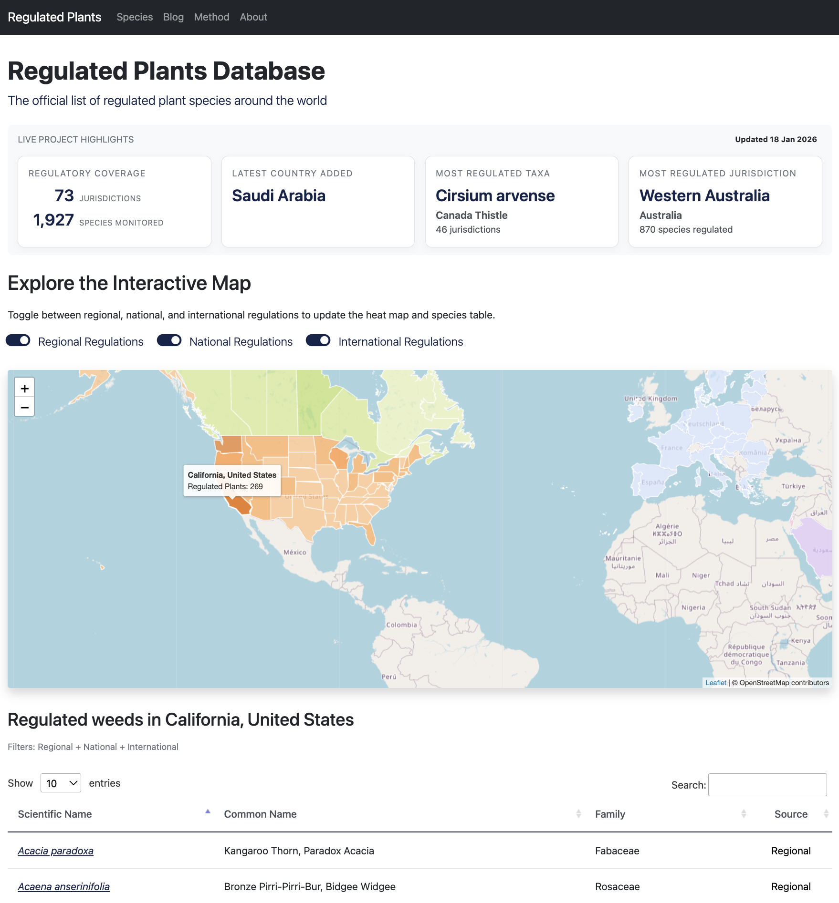

# Regulated Plants Database (Web App)

**An environmental compliance analytics platform**

> Business & policy analytics system for exploring regulated invasive plant species across jurisdictions. This repository contains the analytics delivery layer (web application + REST endpoints). The full global dataset and ingestion pipeline are maintained separately to ensure proper data governance; a California-only sample dataset is included here to enable reproducible local analysis and development.



## Analytics context

Environmental compliance depends on knowing which plant species are regulated, where, and to what extent.
In practice, this information is fragmented across government sources, published in inconsistent formats, and difficult to compare across regions.

This project transforms raw regulatory lists into decision-ready intelligence by:
- Normalising jurisdictional and taxonomic data
- Designing interpretable regulatory intensity metrics
- Delivering geospatial and species-centric analytical views
- Supporting downstream use cases such as compliance screening and policy benchmarking

---

## Table of Contents
1. [Analytical Features](#analytical-features)
2. [Tech Stack](#tech-stack)
3. [Getting Started](#getting-started)
4. [Environment Configuration](#environment-configuration)
5. [Local Sample Data](#local-sample-data)
6. [Remote Data Service](#remote-data-service)
7. [Deployment](#deployment)
8. [Project Structure](#project-structure)
9. [Contributing](#contributing)

---

## Analytical Features
- **Geospatial regulatory analysis:** Interactive Leaflet map with fixed analytical colour thresholds representing regulatory intensity by jurisdiction.
- **Species-based analytical lookup:** Search regulated species to identify all jurisdictions where regulation applies, enabling cross-border risk assessment.
- **Layered regulatory scope**: Toggle regional, national, and international regulation layers to isolate policy drivers.
- **Tabular analytics & exports:** Structured tables support filtering, comparison, and downstream analysis.
- **Supporting methodology & sources:** Blog and methodology pages document analytical assumptions, data sources, and limitations.

## Tech Stack
- **Backend:** Flask, SQLite (via custom utility classes in `app/utils`)
- **Frontend:** Bootstrap 5, Leaflet, DataTables, Select2, vanilla JS
- **Email & Security:** Flask-Mail, Flask-Limiter, reCAPTCHA

## Getting Started
This repository can be run locally using a self-contained analytical sample (California only).
```bash
# Clone the repo
git clone https://github.com/<your-org>/regulated_plants_app.git
cd regulated_plants_app

# Create & activate virtual environment
python3 -m venv weeds_env
source weeds_env/bin/activate

# Install dependencies
pip install --upgrade pip
pip install -r requirements.txt
```

## Environment Configuration
Copy `.env.example` to `.env` (or export variables another way) and set:

| Variable | Description |
| --- | --- |
| `SECRET_KEY` | Flask session key |
| `EMAIL_USERNAME` / `EMAIL_PASSWORD` | SMTP credentials for contact form |
| `RECAPTCHA_SITE_KEY` / `RECAPTCHA_SECRET_KEY` | Google reCAPTCHA keys |
| `DATA_MODE` | `local_sample` (default) or `remote_production` |
| `DATA_REMOTE_BASE_URL` | Base URL of the private data service (remote mode) |
| `DATA_REMOTE_TOKEN` | Bearer token for the data service (remote mode) |
| `DATA_MANIFEST_TTL_SECONDS` | Poll interval for data updates (default `0`, disabled) |
| `DATA_REMOTE_TIMEOUT_SECONDS` | Remote fetch timeout in seconds (default `90`) |
| `OOZR_BASE_URL` | OOZR dashboard base URL (example: `https://oozr.up.railway.app`) |
| `OOZR_PROJECT_SLUG` | Project slug for activations (default `regulatedplants`) |
| `OOZR_METRICS_ENABLED` | Enable activation tracking (`1`/`0`, default `0`) |

The app reads these via `Config` in `app/config.py`.

## OOZR Activation Tracking
This research project tracks one signal only: activation.

- **Aha moment**: first time a unique user clicks the map and receives regulated species results.
- Anonymous user identity is stored in browser cookie `anonymous_user_id`.
- After successful activation send, cookie `aha_activated=1` is set to prevent repeat emits.
- Activation is sent to OOZR canonical endpoint:
  - `POST {OOZR_BASE_URL}/api/activate`
  - payload: `{ "project": "regulatedplants", "anonymous_id": "...", "timestamp": "ISO-8601" }`

## Local Sample Data
This repo includes a minimal California-only sample dataset for local use:

- `app/static/data/sample/weeds_sample.db`
- `app/static/data/sample/geojson/united_states.geojson`

`DATA_MODE=local_sample` uses these by default.

## Remote Data Service and Governance
In production, the application consumes versioned analytical artifacts from a private data service.

This separation reflects real-world analytics practice:
- Controlled data stewardship
- Licensing and source attribution
- Safe public consumption of derived insights

Expected endpoints on the data service:
- `GET /manifest.json`
- `GET /artifacts/weeds.db`
- `GET /artifacts/geojson/<file>.geojson`

Remote data behavior in `remote_production`:
- If a valid local cache exists, boot immediately from cache.
- Refresh runs in the background only when `DATA_MANIFEST_TTL_SECONDS > 0`.
- If refresh fails (timeout/checksum/network), the app keeps serving the last valid cache.
- Only first-ever cold start (no cache) blocks on remote bootstrap.

The data service lives in a separate private repo (e.g., `regulated_plants_data`).

## Website API Scope
This repository exposes the website-facing API only (global and optimized for the site UX).

Current routes include:
- `/api/region-weed-counts`
- `/api/region`
- `/api/geojson-files`
- `/api/home-highlights`
- `/species/api/search`
- `/species/api/weed-states/by-key/<usage_key>`

A separate stricter external compliance API (US-focused, versioned, partner-facing) is planned as a distinct surface.

## Deployment
1. Set environment variables for production.
2. Use `gunicorn main:app` or `Procfile` for your platform.
3. Ensure the data service URL + token are configured.
The live deployment is hosted under an institutional domain and used by public and academic stakeholders.

## Project Structure
```
regulated_plants_app/
├── app/
│   ├── static/         # JS, CSS, images, sample data
│   ├── templates/      # Jinja templates
│   ├── utils/          # Database + helper classes
│   └── views.py        # Flask blueprints & routes
├── requirements.txt
├── Procfile
└── main.py             # Flask entrypoint
```

## Contributing
Contributions are welcome, particularly in areas related to:
- Analytical extensions
- Data validation or quality checks
- New jurisdiction support (with documented sources)

1. Fork + branch from main
2. Keep PRs focused and documented
3. Update docs or methodology notes where relevant
